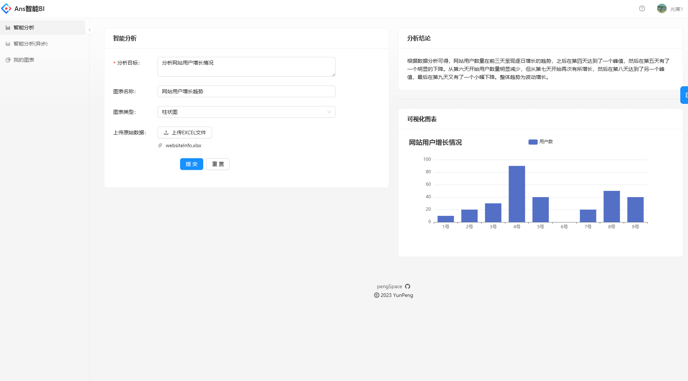
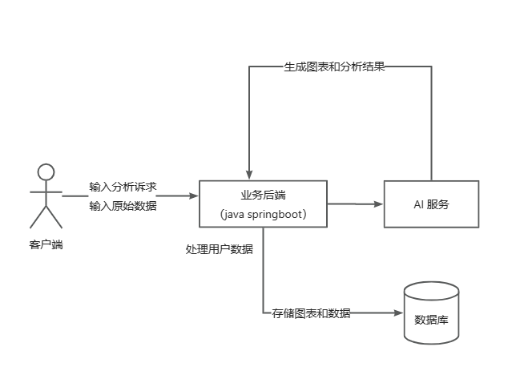
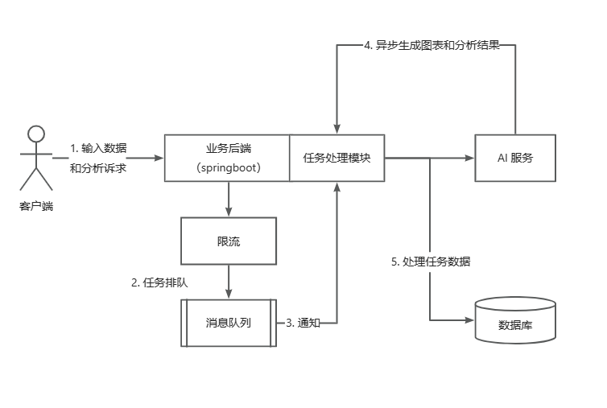
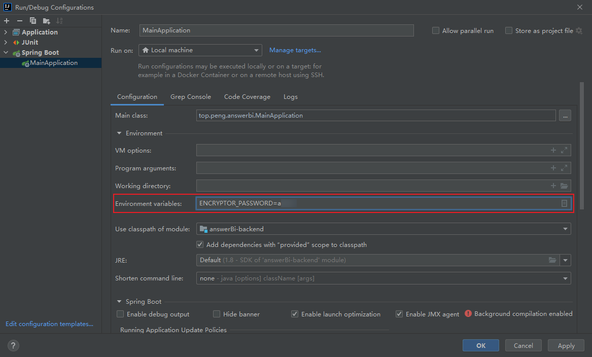

# AnswerBi

## 项目技术栈

### 后端

- SpringBoot
- MySQL
- Redis
- MyBatis + MyBatis Plus 数据访问框架
- 消息队列（RabbitMQ）
- 限流(实现了分别基于Guava和Redisson的单机和分布式两种限流)
- AI能力 (Open AI接口 / **[鱼聪明AI SDK](https://github.com/liyupi/yucongming-java-sdk)** )
- Easy Excel
- Swagger + Knife4j 接口文档
- Hutool 工具库

### 前端

- React
- Umi + Ant Design Pro
- 可视化开发库 (Echarts)
- Umi openapi 代码生成 

## 业务功能
用户（数据分析者）只需要导入最原始的数据集（excel文件），输入想要进行分析的目标（比如帮我分
析一下网站的增长趋势)，就能利用AI自动生成一个符合要求的图表以及结论。


 
保留了同步和异步两种方式

- **同步**: 用户需要等待AI生成结果
- **异步**: 上传后即时返回提示，告知用户“您的数据正在分析，请稍后在我的图表页面查看”，提升用户体验

### 流程架构设计

- 同步
  
- 异步
  

## 本地运行
### [后端](https://gitee.com/anscoder/answerBi-backend) 
#### MySQL 数据库

1）修改 `application.yml` 的数据库配置为你自己的：

```yml
spring:
  datasource:
    driver-class-name: com.mysql.cj.jdbc.Driver
    url: jdbc:mysql://localhost:3306/my_db
    username: root
    password: 123456
```

2）执行 `sql/create_table.sql` 中的数据库语句，自动创建库表

#### Redis 

1）修改 `application.yml` 的 Redis 配置为你自己的：

```yml
spring:
  redis:
    database: 1
    host: localhost
    port: 6379
    timeout: 5000
    password: 123456
```

2）移除 `MainApplication` 类开头 `@SpringBootApplication` 注解内的 exclude 参数：

修改前：

```java
@SpringBootApplication(exclude = {RedisAutoConfiguration.class})
```

修改后：


```java
@SpringBootApplication
```
#### RabbitMq
修改 `application.yml` 的 RabbitMq 配置为你自己的
```yml
spring:
  rabbitmq:
    host: localhost
    port: 5672
    username: guest
    password: guest
```

#### 鱼聪明AI
修改 `application.yml` 的 鱼聪明AI 配置为你自己的
```yml
yuapi:
  client:
    access-key: xxx
    secret-key: xxx
```

配置完成启动项目，访问 `http://localhost:8101/api/doc.html` 即可打开接口文档

> **ENC加密配置文件中的内容**
> 
> 1) 使用EncryptorTest.java对你需要加密的内容加密，获取密文，在配置文件进行替换
>   ```yaml
>   spring:
>     datasource:
>       password: ENC(加密后的密文)
>   ```
> 2) 启动时指定环境变量 ${ENCRYPTOR_PASSWORD}
> - idea
> 
> - 命令行启动
> ```shell
> java -jar answerBi-backend.jar --ENCRYPTOR_PASSWORD=xxx 
> ```

### [前端](https://gitee.com/anscoder/answer-bi-frontend)
1）执行 npm install 或 yarn 安装依赖
```shell
  npm install
```
或者
```shell
yarn
```
2）运行项目
```shell
yarn run dev
```

## 后续计划
- [x] 使用死信队列处理异常情况，将图表生成任务置为失败
- [x] 引入Guava RateLimiter(单机) 和 Redisson RateLimiter(分布式) 两种限流机制 (在请求方法上添加注解即可限流，方便快捷)
- [x] 支持用户对失败的图表进行手动重试
- [x] 引入redis缓存提高加载速度
- [x] 引入jasypt encryption 对配置文件加密、解密
- [x] 给任务执行增加 guava Retrying重试机制，保证系统可靠性 
    (guava Retrying 要使用 AttemptTimeLimiters.fixedTimeLimit()设置固定时间的超时限制 时需要 保证 guava版本在22或22以下)
- [ ] 定时任务把失败状态的图表放到队列中(补偿机制)
- [ ] 给任务的执行增加超时时间，超时自动标记为失败(超时控制)
- [ ] 图表数据分表存储，提高查询灵活性和性能
- [ ] 任务执行结果通过websocket实时通知给用户
- [ ] 我的图表管理页增加一个刷新、定时刷新的按钮，保证获取到图表的最新状态(前端轮询)
